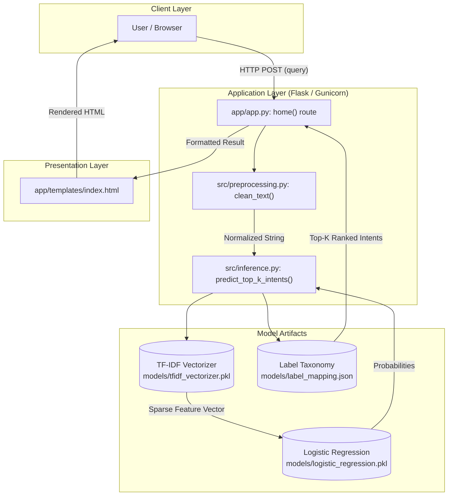

# Bank Issue Intent Classifier

> A production-ready, stateless NLP system for classifying customer banking queries into fine-grained intent categories using TF-IDF feature engineering and Multinomial Logistic Regression.

[](https://www.python.org/)
[](https://flask.palletsprojects.com/)
[](https://scikit-learn.org/)
[](https://gunicorn.org/)
[](LICENSE)

[Repository](https://github.com/Rohitk69992/Bank-Issue-Intent-Classifier) • [Architecture](#system-architecture) • [ML Pipeline](#machine-learning-pipeline) • [Model Details](#model-details) • [Quickstart](#installation)

---

## Overview

In retail and commercial banking customer support, automated query triage is vital for operational efficiency. Unstructured customer inquiries often arrive with high lexical variance, slang, or urgency. Without automated routing, support desks suffer from high latency, misplaced ticket escalation, and inconsistent service delivery.

The **Bank Issue Intent Classifier** solves this challenge by automatically categorizing incoming customer queries into **77 fine-grained banking intent classes** (such as `declined_card_payment`, `pending_cash_withdrawal`, `card_arrival`, and `change_pin`).

### System Workflow
1. **Input:** Unstructured natural-language text submitted via web interface or modular inference utility.
2. **Processing:** Automated text cleaning, sub-linear TF-IDF vectorization, and multi-class probability scoring.
3. **Prediction:** Top-ranked candidate intents mapped to human-readable issue descriptions.
4. **Output:** Real-time web display of the primary detected intent, backed by a fully stateless runtime.

---

## Key Features

- **77 Granular Banking Classes:** Trained on a comprehensive banking customer domain taxonomy covering cards, transfers, accounts, fees, and security.
- **Stateless Inference Architecture:** Zero persistent storage or external database dependencies; highly portable across containerized or serverless hosting environments.
- **Top-K Ranked Intent Extraction:** Inference engine computes normalized posterior class probabilities and returns top-$k$ candidate predictions.
- **Lightweight & Low-Latency:** Classical NLP architecture (TF-IDF + Logistic Regression) yields sub-10ms CPU inference times without heavy GPU overhead.
- **Production-Ready Web Service:** Built with Flask and Gunicorn WSGI, featuring responsive UI styling and structured logging.

---

## System Architecture



---

## Machine Learning Pipeline

```
Raw Query
   │
   ▼
[ 1. Preprocessing ] ────► Lowercase, regex whitespace normalization, character trimming
   │
   ▼
[ 2. Feature Extraction ] ─► TfidfVectorizer (unigrams & bigrams, max_features=5000, min_df=2)
   │
   ▼
[ 3. Model Scoring ] ─────► Multinomial Logistic Regression (L-BFGS solver)
   │
   ▼
[ 4. Probability Sorting ] ─► np.argsort descending probability extraction
   │
   ▼
[ 5. Intent Mapping ] ────► Resolve integer class ID against label_mapping.json (77 classes)
   │
   ▼
Formatted Prediction Dict (Top-K candidates + Confidence Scores)
```

1. **Text Preprocessing (`src/preprocessing.py`):** Converts raw input to lowercase, normalizes variable whitespace sequences using regular expressions (`\s+`), and strips surrounding whitespace.
2. **Vectorization (`src/inference.py`):** Transforms normalized queries into a 5,000-dimensional sparse feature space using word unigram and bigram term frequencies weighted by inverse document frequency.
3. **Inference:** Multinomial logistic regression estimates the posterior probability distribution $P(y = c \mid \mathbf{x})$ over all 77 target classes via softmax.
4. **Post-Processing:** Ranks candidates by probability, extracts top-$k$ intents with confidence scores rounded to four decimal places, and converts internal snake_case identifiers into human-readable issue titles.

---

## Model Details

| Attribute | Specification |
| :--- | :--- |
| **Problem Type** | Multi-Class Text Classification |
| **Number of Classes** | 77 fine-grained banking intents |
| **Feature Representation** | TF-IDF (Unigrams & Bigrams, sublinear TF) |
| **Vocabulary Size** | 5,000 features (`min_df=2`) |
| **Classifier Algorithm** | Logistic Regression (`solver='lbfgs'`, `max_iter=1000`, `random_state=42`) |
| **Benchmark Dataset** | Banking77 (`mteb/banking77` via Hugging Face) |
| **Dataset Splits** | 10,003 train samples / 3,076 test samples |
| **Evaluated Test Accuracy** | **85.89%** (holdout evaluation on 3,076 test samples) |
| **Inference Artifacts** | Serialized `.pkl` models via Joblib + `.json` label mapping |

---

## Project Structure

```bash
Bank-Issue-Intent-Classifier/
├── app/
│   ├── static/
│   │   └── style.css            # Dark-themed responsive application styling
│   ├── templates/
│   │   └── index.html           # Main query submission and prediction UI
│   └── app.py                   # Flask web service and HTTP routing
├── models/
│   ├── label_mapping.json       # Mapping from 77 integer class IDs to intent strings
│   ├── logistic_regression.pkl  # Trained Scikit-Learn Logistic Regression model
│   └── tfidf_vectorizer.pkl     # Fitted 5,000-feature TF-IDF vectorizer
├── src/
│   ├── __init__.py
│   ├── config.py                # Artifact path definitions and default top-k settings
│   ├── preprocessing.py         # Regex-based text normalization
│   ├── inference.py             # Inference pipeline & probability extraction logic
│   └── train.py                 # Dataset loading, vectorizer fitting, and training script
├── Procfile                     # Gunicorn WSGI deployment entry point
├── requirements.txt             # Production runtime dependencies
├── requirements-training.txt    # Additional dependencies for training & evaluation
├── runtime.txt                  # Python runtime specification
└── README.md
```

---

## Installation

### Prerequisites
- Python 3.11 or higher
- Git

### 1. Clone the Repository
```bash
git clone https://github.com/Rohitk69992/Bank-Issue-Intent-Classifier.git
cd Bank-Issue-Intent-Classifier
```

### 2. Create and Activate a Virtual Environment
```bash
# Windows (PowerShell)
python -m venv .venv
.venv\Scripts\Activate.ps1

# Linux / macOS
python3 -m venv .venv
source .venv/bin/activate
```

### 3. Install Runtime Dependencies
```bash
pip install --upgrade pip
pip install -r requirements.txt
```

> **Note on Model Retraining:** To retrain the model with `src/train.py`, install the training suite via `pip install -r requirements-training.txt` (includes `pandas` and `datasets`).

---

## Running the Application

### Local Development Server
Execute the Flask application module:
```bash
python -m app.app
```
The server will start locally at:
```text
http://127.0.0.1:5000
```

### Production WSGI Server (Gunicorn)
To run via production-grade WSGI server as configured in the `Procfile`:
```bash
gunicorn app.app:app --bind 0.0.0.0:5000 --workers 2
```

---

## Usage

1. Open `http://127.0.0.1:5000` in any web browser.
2. Enter a natural-language banking query into the text area (e.g., *"cash withdrawal is still pending"*).
3. Click **Detect Banking Issue**.
4. The system executes the inference pipeline and displays the primary intent category on the interface.

### Programmatic Python Usage
The inference pipeline can also be called directly in Python without starting the web server:

```python
from src.inference import predict_top_k_intents

result = predict_top_k_intents("cash withdrawal is still pending", k=3)

print("Cleaned Query:", result["cleaned_query"])
print("Top Prediction:", result["top_predictions"][0]["intent"])
print("Confidence:", result["top_predictions"][0]["confidence_score"])
```

**Output:**
```python
Cleaned Query: 'cash withdrawal is still pending'
Top Prediction: 'pending_cash_withdrawal'
Confidence: 0.9474
```

---

## Example Predictions

The table below demonstrates verified predictions generated directly by the trained model:

| User Query | Predicted Intent Identifier | UI Display Output | Confidence Score |
| :--- | :--- | :--- | :--- |
| `cash withdrawal is still pending` | `pending_cash_withdrawal` | Pending Cash Withdrawal | 0.9474 |
| `where is my new card` | `card_arrival` | Card Arrival | 0.7110 |
| `how can I pin change on my card` | `change_pin` | Change Pin | 0.5098 |
| `why is the exchange rate so high` | `card_payment_wrong_exchange_rate` | Card Payment Wrong Exchange Rate | 0.4158 |
| `my card payment failed online` | `declined_card_payment` | Declined Card Payment | 0.3987 |

---

## Web Service & Backend Architecture

The application implements a stateless Flask web service in [`app/app.py`](app/app.py):

- **`GET /`**: Delivers the user-facing HTML interface (`app/templates/index.html`) containing the input form.
- **`POST /`**:
  - Extracts the form field `query`.
  - Invokes `predict_top_k_intents(query)` from `src.inference`.
  - Formats the predicted intent identifier into title case (`display_intent`).
  - Passes the resulting structured payload to the template engine for server-side HTML rendering.
- **Stateless Execution:** Predictions are computed purely in memory per request. There are no background database queries, connections, or persistent file writes during runtime.

---

## Deployment

The application is architected for frictionless cloud deployment on platforms such as **Render**, **Vercel**, or standard Linux VM environments:

- **WSGI Entry Point:** Defined in `Procfile` as `web: gunicorn app.app:app`.
- **Stateless Operation:** Since no database drivers or local file writing operations are performed during requests, the application is compatible with serverless execution environments and read-only container filesystems.
- **Memory Footprint:** The vectorizer and logistic regression weights occupy less than 5 MB of disk space and under 150 MB of resident runtime memory, allowing deployment on resource-constrained micro instances.

---

## Limitations

- **Domain Specificity:** The classifier is trained specifically on customer banking inquiries. Out-of-domain queries (e.g., general chit-chat, flight bookings) will still be mapped to the closest banking category.
- **Uncalibrated Softmax Probabilities:** Multinomial logistic regression produces confidence scores that reflect class separation rather than strictly calibrated Bayesian probabilities.
- **Bag-of-Words Limitations:** TF-IDF n-grams model surface syntax and lexical patterns, but do not capture deep contextual dependencies or complex semantic inversions like bidirectional Transformer architectures.
- **Single-Turn Scope:** The model operates strictly on isolated customer queries and does not track multi-turn dialogue history.

---

## Future Improvements

- [ ] **Transformer Fine-Tuning:** Evaluate fine-tuned lightweight Transformer models (e.g., `DistilBERT` or `RoBERTa-base`) for complex contextual nuances.
- [ ] **REST API Endpoint:** Add a dedicated `/api/v1/predict` JSON endpoint supporting programmatic batch queries.
- [ ] **Out-of-Scope (OOS) Detection:** Implement a confidence thresholding mechanism or one-class classifier to flag out-of-domain input.
- [ ] **Probability Calibration:** Apply Platt scaling or Isotonic regression to calibrate confidence scores.
- [ ] **Automated Testing Suite:** Introduce unit tests (`pytest`) covering preprocessing boundary conditions and inference schema integrity.

---

## Technical Stack

| Layer | Technology | Purpose |
| :--- | :--- | :--- |
| **Language** | Python 3.11+ | Core programming runtime |
| **Web Framework** | Flask 3.1.3 | HTTP routing and template serving |
| **WSGI Server** | Gunicorn 26.0.0 | Production HTTP process management |
| **Machine Learning** | Scikit-Learn 1.8.0 | Vectorization, Logistic Regression, evaluation |
| **Scientific Computing** | NumPy 2.4.4, SciPy 1.17.1 | Numerical matrix and vector operations |
| **Model Serialization** | Joblib 1.5.3 | Serialized model and vectorizer loading |
| **Training Pipeline** | Datasets 4.8.5, Pandas 3.0.3 | Banking77 dataset ingestion and tabular handling |
| **Frontend** | HTML5, CSS3 | Dark-themed responsive UI |

---

## Author

**Rohit K.**  
*AI & Data Science Student*  
GitHub: [@Rohitk69992](https://github.com/Rohitk69992)
